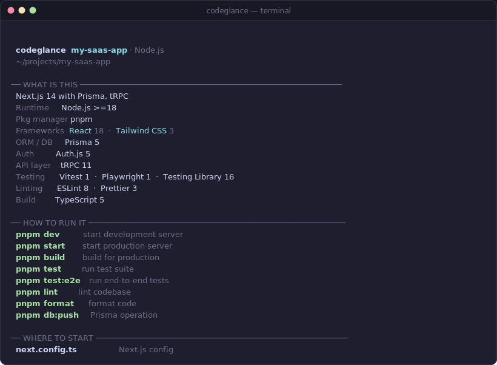

<div align="center">

# codeglance

**The 10-second codebase tour.**

*Open a repo. Run one command. Know where to start.*

[](LICENSE)
[](https://nodejs.org)
[](https://www.npmjs.com/package/codeglance)

</div>

---

```
npx codeglance
```

No install. No config. No API keys.

---

<div align="center">

</div>

---

## Try it now

```bash
npx codeglance                                        # tour of current directory
npx codeglance --for-ai                               # compact LLM context brief
npx codeglance --markdown --output docs/codebase-tour.md  # save as Markdown
```

No install required. Runs on any directory. Works best on repos with common manifest files.

---

## When should I use this?

- **Joining a new codebase** — Skip the 15-minute ritual of reading README, exploring directories, and parsing package.json manually
- **Evaluating a dependency** — Understand what a library actually uses before you adopt it
- **Returning to an old project** — Re-orient yourself after months away
- **Before using Claude, Cursor, or Copilot** — Run `codeglance --for-ai` to generate a structured context brief instead of dumping the whole codebase
- **Onboarding your team** — `codeglance --markdown > docs/codebase-tour.md` creates a living onboarding document

---

## What makes this different?

**Not a line counter.** tokei and scc count lines of code. They don't tell you what framework you're looking at or how to run it.

**Not a source-code dumper.** repomix and code2prompt pack source for LLM consumption. codeglance produces a context *brief* — just the orientation layer.

**Not an AI agent.** No generation, no inference, no API calls. It reads manifest files and file structure, then reports what it finds.

**A repo orientation layer.** It answers five questions in one command: what is this, how do I run it, where do I start, what tools does it use, and how do I hand it off to an LLM.

---

## Real-world examples

All outputs below were captured by running codeglance against the actual repos.

### charmbracelet/glow — Go CLI (15k⭐)

```
  codeglance  glow · Go
  charmbracelet/glow

── WHAT IS THIS ──────────────────────────────────────────────────────
  CLI tool (Go) using Cobra
  Runtime     Go 1.25.9
  Other        Viper 1.21.0

── HOW TO RUN IT ─────────────────────────────────────────────────────
  go run .         run main package
  go build ./...   compile all packages
  go test ./...    run test suite
  go vet ./...     run static analysis

── WHERE TO START ────────────────────────────────────────────────────
  main.go           main package
  Dockerfile        container definition
  config_cmd.go     cmd configuration
  github.go         GitHub integration
  gitlab.go         GitLab integration
  url.go            URL parsing
  ui/markdown.go    Markdown renderer

── TOOLS DETECTED ────────────────────────────────────────────────────
  CI/CD        GitHub Actions (6 workflows)
  Container    Docker
  Linting      golangci-lint

── CODEBASE ──────────────────────────────────────────────────────────
  Go    25 files  3.6k lines  ███████████████░░░  86%
  45 files  ·  4.2k lines  ·  4 languages
```

### expressjs/express — Node.js web framework (65k⭐)

```
  codeglance  express · Node.js
  expressjs/express

── WHAT IS THIS ──────────────────────────────────────────────────────
  Node.js project — ESLint
  Runtime     Node.js >= 18
  Pkg manager npm
  Linting      ESLint 8

── HOW TO RUN IT ─────────────────────────────────────────────────────
  npm run test       run test suite
  npm run lint       lint codebase

── WHERE TO START ────────────────────────────────────────────────────
  lib/express.js       express
  lib/utils.js         utilities
  lib/view.js          view/template layer
  lib/application.js   app bootstrap
  lib/request.js       request object
  lib/response.js      response object

── TOOLS DETECTED ────────────────────────────────────────────────────
  Testing      (test/)
  CI/CD        GitHub Actions (4 workflows)
  Linting      ESLint

── CODEBASE ──────────────────────────────────────────────────────────
  JavaScript    141 files  21k lines  ███████████████░░░  82%
  213 files  ·  26k lines  ·  6 languages
```

### pallets/flask — Python web framework (68k⭐)

```
  codeglance  flask · Python
  pallets/flask

── WHAT IS THIS ──────────────────────────────────────────────────────
  CLI tool (Python) using Click
  Runtime     Python >=3.10

── HOW TO RUN IT ─────────────────────────────────────────────────────
  pytest         run test suite
  ruff check .   lint with Ruff

── WHERE TO START ────────────────────────────────────────────────────
  src/flask/app.py            flask entry
  src/flask/blueprints.py     route blueprints
  src/flask/config.py         configuration
  src/flask/globals.py        global request context
  src/flask/logging.py        logging setup
  src/flask/sessions.py       session management

── TOOLS DETECTED ────────────────────────────────────────────────────
  Testing      (tests/)
  CI/CD        GitHub Actions (5 workflows)
  Linting      Ruff  ·  mypy

── CODEBASE ──────────────────────────────────────────────────────────
  Python    83 files  18k lines  ██████████░░░░░░░░  53%
  233 files  ·  35k lines  ·  10 languages
```

---

## The `--for-ai` mode

Run `codeglance --for-ai` to get a compact, structured LLM context brief. Paste it into Claude, GPT, or Gemini before asking about the codebase. Typically under 300 tokens. No source code.

```markdown
# Codebase Context: my-saas-app

## Stack
Next.js 14 with Prisma, tRPC
Runtime: Node.js >=18 · Package manager: pnpm

## Commands
- **dev:** `pnpm dev`
- **build:** `pnpm build`
- **test:** `pnpm test`
- **lint:** `pnpm lint`

## Key Files
- `next.config.ts` — Next.js config
- `prisma/schema.prisma` — Prisma data model
- `src/server/routers/app.ts` — tRPC router
- `src/lib/db.ts` — database client

## Libraries
Prisma, Auth.js, tRPC, Vitest, Playwright

## Infrastructure
GitHub Actions (1 workflows) · docker-compose

---
*Generated by codeglance. Heuristic — not exhaustive.*
```

```bash
codeglance --for-ai | pbcopy    # macOS
codeglance --for-ai | xclip     # Linux
```

---

## Install

```bash
npx codeglance                        # zero install, works immediately
npm install -g codeglance             # install globally
```

---

## Usage

```bash
codeglance [path]                     # analyze current dir or a path
codeglance --for-ai                   # compact LLM context brief
codeglance --markdown                 # Markdown report
codeglance --json                     # machine-readable output
codeglance --output docs/tour.md      # save to file
codeglance --no-git                   # skip git analysis (faster on large repos)
```

### Generate a living onboarding document

```bash
codeglance --markdown --output docs/codebase-tour.md
```

Check it in. Regenerate when the architecture changes. [See the generated output for this repo →](docs/codebase-tour.md)

On GitHub repos, file paths in the "Where to Start" section are automatically linked to the actual files on github.com.

---

## Supported ecosystems

| Ecosystem | Manifest | What gets detected |
|-----------|----------|--------------------|
| **Node.js** | `package.json` | Next.js, React, Vue, Angular, Svelte, Express, NestJS, Fastify, Prisma, Drizzle, tRPC, GraphQL, Vitest, Jest, Playwright, ESLint, Tailwind — 50+ packages |
| **Python** | `pyproject.toml`, `requirements.txt` | FastAPI, Django, Flask, SQLAlchemy, Pydantic, Pytest, Ruff, Black, PyTorch, LangChain, Anthropic SDK |
| **Go** | `go.mod` | Gin, Echo, Fiber, Chi, GORM, Cobra, gRPC, Zap |
| **Rust** | `Cargo.toml` | Axum, Actix-web, Rocket, Tokio, SQLx, Clap, Serde, Tracing |
| **C/C++** | `CMakeLists.txt` | GoogleTest, Catch2, Boost, Qt, OpenCV; CMake version and C++ standard |
| **Java** | `pom.xml`, `build.gradle` | Spring Boot, Spring MVC, Spring Security, Spring Data JPA, Hibernate, Quarkus, Micronaut, Vert.x, JUnit 5, Mockito |
| **Terraform** | `*.tf` | Cloud providers (AWS, GCP, Azure, Kubernetes, Cloudflare…), module count, resource count; all six standard `terraform` commands |

---

## Why not tokei / scc / repomix?

Use the right tool for the job:

- **tokei / scc** — accurate LOC counts by language. Best when you need raw code size data.
- **repomix / code2prompt** — pack source code into a file for LLM consumption. Best when you need to feed a full codebase to a model.
- **codeglance** — repo orientation. Best when you need to understand a repo before you start working with it.

| | codeglance | tokei/scc | repomix |
|---|:---:|:---:|:---:|
| Framework detection | ✓ | ✗ | ✗ |
| Run/build/test commands | ✓ | ✗ | ✗ |
| Entry points | ✓ | ✗ | ✗ |
| "Files to read first" | ✓ | ✗ | ✗ |
| CI / Docker / tooling | ✓ | ✗ | ✗ |
| Language stats | ✓ | ✓ | ✗ |
| LLM context brief | ✓ | ✗ | ✓ (full source) |
| Zero config | ✓ | ✓ | ✓ |

---

## Limitations

codeglance is transparent about what it is and what it is not:

- **Heuristic, not semantic.** It reads manifest files and file structure. It does not parse source code or understand logic.
- **Framework detection depends on manifests.** Projects without a standard package file (go.mod, package.json, Cargo.toml, pyproject.toml, CMakeLists.txt) produce shallow output.
- **Mixed-ecosystem repos** (a Python backend + Node.js frontend) are analyzed from the first detected ecosystem. The other ecosystem's files still appear in language stats and WHERE TO START.
- **Library repos** that are a framework themselves (e.g., fastapi, gin-gonic/gin) show their own dependencies, not their framework name.
- **Ruby and PHP are not yet supported.** `.rb` and `.php` files are counted in language stats, but Gemfile and composer.json are not parsed. See [Contributing](#contributing) to add support.
- **Monorepos** get a single summary, not per-package analysis.
- **Large repos** are capped at 25,000 files. A note appears in the output.
- **"Start here" ranking is approximate.** Based on file depth, naming patterns, and size — not import graph analysis.

---

## Contributing

Each ecosystem detector is a self-contained module. **Adding a framework takes ~3 lines:**

```typescript
// src/detectors/frameworks.ts — add to the relevant array:
const NODE_FRAMEWORKS: FrameworkDef[] = [
  // ...
  { name: 'My Framework', category: 'web_framework', keys: ['my-framework-package'] },
];
```

Add a fixture + test, run `npm test`, submit a PR. Full guide: [CONTRIBUTING.md](CONTRIBUTING.md)

**Open contributions:**
- Ruby/Rails detector (Gemfile)
- PHP/Laravel/Symfony detector (composer.json)
- Elixir/Phoenix detector (mix.exs)
- pnpm workspace monorepo detection
- Python dev server command inference (e.g., `uvicorn` for FastAPI)
- Improve Rust "start here" ranking with workspace support
- Kotlin/Android detector (build.gradle.kts)

---

## Roadmap

**v0.2.0** ✓ — Java/Maven/Spring Boot, Terraform, docker-compose env vars, GitHub hyperlinks in `--markdown`  
**v0.3** — Ruby, PHP, Kotlin/Android, Elixir, monorepo support  
**v0.4** — `--since` diff mode, import graph analysis  
**v0.5** — GitHub Action, Homebrew tap, `--watch` mode  

Full roadmap: [ROADMAP.md](ROADMAP.md)

---

## License

MIT — see [LICENSE](LICENSE).
